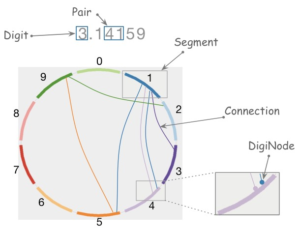

#  
# Circular visualization of data
 
 
 
A simple experiment with 2D graphics to create circular visualisations of numbers
like &#960; (pi), e (Euler number) or similar - that might grow 
into something more general.

Inspired by [Martin Krzywinski](http://mkweb.bcgsc.ca/pi/art/method.mhtml) and his
website "The art of Pi".

Currently implemented using [Java2D](https://docs.oracle.com/javase/tutorial/2d/),
but architected to supply other 2D toolkits (like JavaFX or HTML5/WebGL).

## Status
Work in progress. 

###  Examples
Version 0.5 has only a single digiNode per segment and only straight connections
between segments.

Version 0.8 has multiple digiNodes, still only straight connections: 

Version 0.9 has multiple digiNodes per segment, evenly spaced,
enhanced by curved (Bezier) connections. It can visualize numbers only. In the following screenshot you can see the (light-gray) configurable debugging raster.

## Goal
The result shall at least look similar to the awesome [mother of circular pi visualisations](http://thecreatorsproject.vice.com/blog/visualising-the-infinite-data-of-pie)

There's even a nice [Numberphile video](https://www.youtube.com/watch?v=NPoj8lk9Fo4) on this kind of graphics.

## Principle

A coarse overview by the [original authors](http://mkweb.bcgsc.ca/pi/art/method.mhtml),
Martin Krzywinski and Cristian Illies Vasile.

1. divide circle into 10 segments, one for each digit
2. for each pair of digits within a number, draw a curve from first-to-second.
3. transition the color of this curve
4. the position of the curve on the segment is determined by the position of the digits

## Domain Terminology

* The number to be visualized consists of ordered Digits.
* Pair consists of left ("from") and right ("to") Digit,
* Connection represents graphical connection of "from" (left) and "to" (right)  
Digit of a Pair.
  * Connection can be a straight line or curve, maybe 
     (quadratic or higher degree) Bézier curve.
* Segment:
  * visually represents all Lines for one specific Digit (either left or right in a Pair).
  * contains ordered list of connection points called "digiNodes" 
     * determines their x/y positions on the drawing canvas.
     * number of digiNodes on segment depends on the count of the corresponding
        digit in the number.
  * has a position on drawing canvas
  * has a Color
  * is shaped like a "circle segment" of 36 degrees (1/10th of a full circle,
  or 0.2*&#960; in radians)
* Line
  * corresponds to a Pair of Digits.
  * Start and end of the line are digiNodes

### Working With Angles
Although it seems easier to treat a Segment as a 36 *degree* unit, 
(instead of 0.2*&#960;, which approximates to 0.6283185307179586, 
a pretty cumbersome number)
working with radian units is the official standard, 
used in the Java Math package.

Alas - in Java2D, some angles are expected in *degrees*, e.g. the
[setArcByCenter](https://docs.oracle.com/javase/8/docs/api/java/awt/geom/Arc2D.html#setArcByCenter-double-double-double-double-double-int-) method to
draw an arc expects its angle-parameters (start, extend) in degrees... (WTF?)

So: angles within Circulizr are internally treated in radian (remember: 180DEG = &#960;RAD)
and converted where needed by Math.toRadians() resp. Math.toDegree.

## Open Questions
* What to do with lines from i to i?
* how to change the color scheme
* Enable command line parameters to determine size, colors etc.

## Color Selection
 
 Selecting color schemes for visualizations should *not* only based
upon pure asthetic aspects, but on research...

[Cynthia Bewer](http://colorbrewer2.org/) gives serious advice on this topic.  

we use [their](http://colorbrewer2.org/?type=qualitative&scheme=Paired&n=10) proposed 10-class scheme for qualitative data.
Please note - this scheme is *not* colorblind safe.

 

## Numbers
I used the following resources for getting the numbers:

* [&#960; (pi): Angio.net](http://www.angio.net/pi/digits.html)
* [e (Euler's number): University of Utah](http://www.math.utah.edu/~pa/math/e.html)

and helped myself with a small script to convert the plain format to
comma-separated digits useable as static ArrayList initializer:
(see package `org.gs.numviz.numbers`)

    def numAsString =
    """3.1415926535 8979323846 2643383279 5028841971 6939937510
       5820974944 5923078164 0628620899 8628034825 3421170679
    """

    def numAsArrayListStr = "["

    def String processSingleChar( String singleC ) {
      if ( singleC.isInteger()) return singleC + ","
        else return ""
    }

    for(int i = 0; i < numAsString.length(); i++) {
        numAsArrayListStr +=
                processSingleChar( numAsString.charAt(i).toString())

        if ((i>0) && (i % 50) == 0) numAsArrayListStr += "\n "
    }

    println numAsArrayListStr

