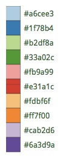

# num-viz: Number visualization 
A simple experiment with 2D graphics to create circular visualisations of numbers
like &#960; (pi), e (Euler number) or similar.

Inspired by [Martin Krzywinski](http://mkweb.bcgsc.ca/pi/art/method.mhtml) and his
website "The art of Pi".

Currently implemented using [Java2D](https://docs.oracle.com/javase/tutorial/2d/).

## Status
Work in progress. 

## Goal
The result shall at least look similar to the awesome [mother of circular pi visualisations](http://thecreatorsproject.vice.com/blog/visualising-the-infinite-data-of-pie)

There's even a nice [Numberphile video](https://www.youtube.com/watch?v=NPoj8lk9Fo4) on this kind of graphics.

## Principle

A coarse overview by the [original authors](http://mkweb.bcgsc.ca/pi/art/method.mhtml),
Martin Krzywinski and Cristian Illies Vasile.

1. divide circle into 10 segments, one for each digit
2. for each pair of digits within a number, draw a curve from first-to-second.
3. transition the color of this curve
4. the position of the curve on the segment is determined by the position of the digits

## Domain Terminology

* The number to be visualized consists of ordered Digits.
* Pair consists of left ("from") and right ("to") Digit,
* Line represents graphical connection of "from" (left) and "to" (right) Digit of a Pair.
* Segment:
  * visually represents all Lines for one specific Digit (either left or right in a Pair).
  * contains ordered list of connection points called "digiNodes" 
  * determines their x/y positions on the drawing canvas.
  * has a position on drawing canvas
  * has a Color
  * is shaped like a "circle segment" of 36 degrees (1/10th of a full circle,
  or 0.2*&#960; in radians)
* Line
  * corresponds to a Pair of Digits.
  * Start and end of the line are digiNodes

### Working With Angles
Although it seems easier to treat a Segment as a 36 *degree* unit, 
(instead of 0.2*&#960;, which approximates to 0.6283185307179586, 
a pretty cumbersome number)
working with radian units is the official standard, consistently applied in Java.

So - all angles within NumViz are given in radian (remember: 180DEG = &#960;RAD).

## Open Questions
* Are lines staight or curved?
  * if curved: what is the radius of the curve drawn?
  * Is it Bezier-style?
* What to do with lines from i to i?
* how to change the color scheme
* Enable command line parameters to determine size, colors etc.

## Color Selection
 
 Selecting color schemes for visualizations should *not* only based
upon pure asthetic aspects, but on research...

[Cynthia Bewer](http://colorbrewer2.org/) gives serious advice on this topic.  

we use [their](http://colorbrewer2.org/?type=qualitative&scheme=Paired&n=10) proposed 10-class scheme for qualitative data.
Please note - this scheme is *not* colorblind safe.

 

## Numbers
I used the following resources for getting the numbers:

* [&#960; (pi): Angio.net](http://www.angio.net/pi/digits.html)

and helped myself with a small script to convert the plain format to
comma-separated digits useable as static ArrayList initializer:

    def numAsString =
    """3.1415926535 8979323846 2643383279 5028841971 6939937510
       5820974944 5923078164 0628620899 8628034825 3421170679
    """

    def numAsArrayListStr = "["

    def String processSingleChar( String singleC ) {
      if ( singleC.isInteger()) return singleC + ","
        else return ""
    }

    for(int i = 0; i < numAsString.length(); i++) {
        numAsArrayListStr +=
                processSingleChar( numAsString.charAt(i).toString())

        if ((i>0) && (i % 50) == 0) numAsArrayListStr += "\n "
    }

    println numAsArrayListStr

