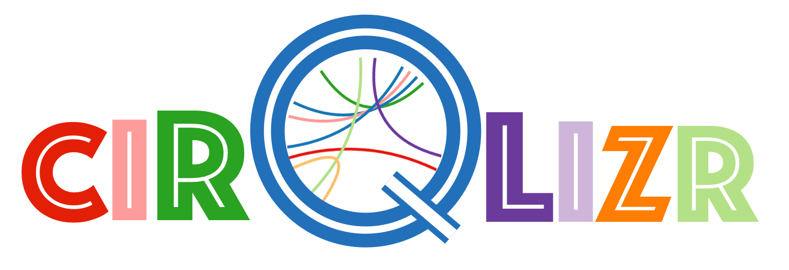

:toc:
:toclevels: 4
:toc-position: left

= 

:numbered!:
== Architecture Documentation

:imagesdir: ./images
:experimental:
:email: gernot.starke@innoq.com
:date: {docdate}
:numbered:

Here you (will soon) find an overview of the internal
design/architecture of kbd:[cirQlizr].

[small]#Version of {docdate}#

== Introduction and Requirements
kbd:[cirQlizr] has been primarily build as a private design challenge.

=== Basic Usage

Prerequisites: Java runtime.

. A user wants to visualize data in circular manner. She configures some parameters
 and starts the system via the command line or the [Gradle] build system.

. A user wants to visualize own data in circular manner. She can either
implement (a subclass of) a DataProvider or supply data in csv or text file.

=== Quality Goals and Solution Approaches

[options="header", cols="1,2,4a,4a"]
.Quality-Goals
|===
| Priority | Quality-Goal | Scenario | Approach

| 1        | Flexibility
| kbd:[cirQlizr] supports multiple UI technologies, e.g:

* Java2D
* JavaFX
* SVG
* <<Processing>>

| Strictly separate _domain_ from _technical_ components within
the software design.

| 2        | Flexibility
| Details of output devices (like resolution), number of lines/connections,
colors etc. can be configured.
| File-based configuration and Configuration class.
|===

== Solution Approach

Adhere to the _separation of concern_ design principle:

* separate user-interface technology from the _domain_ of circular
computation, segments and connections

See <<Building-Blocks>> for details.

[[Building-Blocks]]
== Building Blocks

=== Whitebox Level-1

kbd:[cirQlizr] implementation has been split into three major
building blocks
[[cirqulizer-overview]]
.Cirqulizer Whitebox (overview)
image::cirqlizr-overview.png[width="70%"]

[cols="1a,3a,2a", options="header"]
.Cirqulizer Level-1 Building Blocks
|===
| Name | Explanation | Sources

| Application Controller  | Creates a valid configuration and
instantiates the domain- and technical components.
| `org.cirqlizr.Application`, `org.cirqlizr.configuration`
| Domain Calculation | Calculates the (logical) coordinates and shapes
of Segments and their sizes, connections and connection-nodes.
| `org.cirqlizr.domain`

| Domain Data | Provides data in either numerical or textual format to
the calculation.
| `org.cirqlirz.domain.data`

| Graphical Output | Creates either an image on the screen (by using a UI toolkit
  like Java2D or JavaFX) or an image file (e.g. -><<processing>> or -><<SVG>>)
| `org.cirqlirz.ui`
|===

=== Whitebox Level-2

[[cirqulizer-whitebox]]
.Cirqulizer Whitebox Level-2 (detailed design)
image::building-blocks-level-2.png[width="80%"]

[cols="1a,3a", options="header"]
.Cirqulizer Level-2 Building Blocks
|===
| Name | Explanation

| ConnectionNode  | A point belonging to a -> Segment where a ->Connection begins
or ends. ConnectionNodes are evenly distributed along their Segment.

| Segment | Part of the circle, associated to zero or more ->Connections.
Correspond to elements of the value-set.

|===

=== Domain Parts
The classes shown in blue within figure <<cirqulizer-whitebox>> belong to the
technology-neutral domain-part of kbd:[cirQlizr]. All domain calculations
are performed within a purely mathematical coordinate system (with resolution or
currently 1000 units) and later transformed into one or more
technical coordinate systems having arbitrary, configurable resolutions.

Section <<coordinates, Concepts/Coordinate-Systems>> explains the details
of this _separation of concern_.

TODO: explain coordinate transformation

=== Connection
A Connection can be a (currently quadratic) <<bezier-curves,Bezier curve>> or
a straight line.

== Runtime Scenarios
=== Top-Level Scenario

[[top-leve-scenario]]
.Cirqulizer Scenario (Top-Level)
image::top-level-scenario.png[width="80%"]

[cols="1a,3a", options="header"]
|===
| Interaction | Explanation
| main        | call main method of class `Application`
| init configuration | parse command line, read configuration file
  and create `Configuration` object
| 
|===

== Concepts

=== Domain Terminology

[[coordinates]]
=== Logical and Technical Coordinate system

All calculations are initially performed by domain classes within
a logical coordinate system with typical mathematical orientation
(x and y axis point right/upwards). Within this coordinate system,
the circle where we create segments and connections has a
radius of 1000 units.

[[logical-coord-system]]
.Logical Coordinate System
image::logical-coords.jpg[]

In the diagram you find one (Bezier) connection (green line) together
with its two ConnectionNodes and the Bezier control point.

=== Angles, Degress and Radians

// TODO

[[bezier-curves]]
=== Bezier Curves

// TODO

=== Building kbd:[cirQlizr]

// TODO

=== Configuration of kbd:[cirQlizr]
kbd:[cirQlizr] expects configuration options to be specified
in the file `cirQlirz.config`, which is read upon startup.

TODO: Supply the filename as command-line parameter.

The comments provided in that file should be sufficient
to understand most of the parameters.

=== UI-Toolkits and Graphical Languages
kbd:[cirQlizr] currently supports Java2D, but is designed to support
JavaFX, SVG and Processing without code changes to its core.

==== Fundamental Graphics Primitives
// TODO

* Angle
* Arc
* Shape (Rectangle, Ellipse)
* Line and (Bezier) Curve

==== Java2D

==== Processing
The https://processing.org/reference/[Processing language] contains many
constructs known from UI toolkits like Java2D.

== Glossary of Terms

BCP:: Bezier Control point.
cirQlizr:: Circular Visualizer
POO:: Point of origin (in a coordinate system)
value-set:: The set of (distinct!) values that are part of the data to be visualized.
In case of numbers, the value-set consists of the digits from 0 to 9.

[[processing]]
https://processing.org/[Processing]:: From their website:
"Processing is a flexible software sketchbook and a language for
learning how to code within the context of visual arts."

A domain-specific language plus corresponding development and runtime tools to
describe and implement graphics, both in 2D and 3D. Processing is implemented
in Java and is available for JavaScript too. kbd:[cirQlizr] uses the Processing language
as one output format.

[[svg]]
http://www.w3.org/Graphics/SVG/[SVG]:: Scalable Vector Graphics.
SVG is a markup language for describing two-dimensional
graphics.
