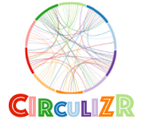
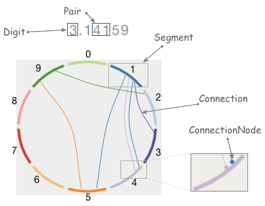
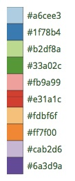

=  Circular visualization of data

Gernot Starke <gernot.starke@innoq.com>
:experimental:
:source-highlighter: coderay
:imagesdir: ../images

[.lead]
A simple experiment with 2D graphics to create circular visualisations
of numbers, like π (pi), e (Euler number) or similar - that might grow
into something more general.

Inspired by http://mkweb.bcgsc.ca/pi/art/method.mhtml[Martin Krzywinski]
and his website "The art of Pi".

Currently implemented using
https://docs.oracle.com/javase/tutorial/2d/[Java2D], +
but architected to supply other 2D toolkits (like JavaFX or
HTML5/WebGL).

== Status

Work in progress.

image:https://img.shields.io/github/license/gernotstarke/circulizr.svg[License] +
image:https://img.shields.io/github/issues/gernotstarke/circulizr.svg[Tasks] +
image:https://badge.waffle.io/gernotstarke/circulizr.svg?label=bug&title=Bugs[Bugs]

[[examples]]
== Examples
See also the Gallery

Version 0.5 had only a single connectionNode per segment and only
straight connections +
between segments.

Version 0.8 had multiple connectionNodes, but still only straight
connections:

Version 0.9 has multiple connectionNodes per segment, evenly spaced, +
enhanced by curved (Bezier) connections. It can visualize numbers only.
In the following screenshot you can see the (light-gray) configurable
debugging raster.

[[goal]]
== Goal

The result shall at least look similar to the awesome
http://thecreatorsproject.vice.com/blog/visualising-the-infinite-data-of-pie[mother
of circular pi visualisations]

There's even a nice
https://www.youtube.com/watch?v=NPoj8lk9Fo4[Numberphile video] on this
kind of graphics.

== Principle

A coarse overview by the
http://mkweb.bcgsc.ca/pi/art/method.mhtml[original authors], +
Martin Krzywinski and Cristian Illies Vasile.

1.  divide circle into 10 segments, one for each digit
2.  for each pair of digits within a number, draw a curve from
first-to-second.
3.  transition the color of this curve
4.  the position of the curve on the segment is determined by the
position of the digits

[[domain-terminology]]
== Domain Terminology

* The number to be visualized consists of ordered Digits.
* Pair consists of left ("from") and right ("to") Digit,
* Connection represents graphical connection of "from" (left) and "to"
(right) +
Digit of a Pair.
* Connection can be a straight line or curve, maybe +
 (quadratic or higher degree) Bézier curve.
* Segment:
* visually represents all Lines for one specific Digit (either left or
right in a Pair).
* contains ordered list of connection points called "connectionNodes"
** determines their x/y positions on the drawing canvas.
** number of connectionNodes on segment depends on the count of the
corresponding +
digit in the number.
* has a position on drawing canvas
* has a Color
* is shaped like a "circle segment" of 36 degrees (1/10th of a full
circle, +
 or 0.2*π in radians)
* Line
* corresponds to a Pair of Digits.
* Start and end of the line are connectionNodes

[[working-with-angles]]
=== Working With Angles

Although it seems easier to treat a Segment as a 36 _degree_ unit, +
(instead of 0.2*π, which approximates to 0.6283185307179586, +
a pretty cumbersome number) +
working with radian units is the official standard, +
used in the Java Math package.

Alas - in Java2D, some angles are expected in __degrees__, e.g. the +
https://docs.oracle.com/javase/8/docs/api/java/awt/geom/Arc2D.html#setArcByCenter-double-double-double-double-double-int-[setArcByCenter]
method to +
draw an arc expects its angle-parameters (start, extend) in degrees...
(WTF?)

So: angles within Circulizr are internally treated in radian (remember:
180DEG = πRAD) +
and converted where needed by Math.toRadians() resp. Math.toDegree.

== Open Questions

* What to do with lines from i to i?
* how to change the color scheme
* Enable command line parameters to determine size, colors etc.

== Color Selection

Selecting color schemes for visualizations should _not_ only based +
upon pure asthetic aspects, but on research...

http://colorbrewer2.org/[Cynthia Bewer] gives serious advice on this
topic.

we use
http://colorbrewer2.org/?type=qualitative&scheme=Paired&n=10[their]
proposed 10-class scheme for qualitative data. +
Please note - this scheme is _not_ colorblind safe.

== Numbers

I used the following resources for getting the numbers:

* http://www.angio.net/pi/digits.html[π (pi): Angio.net]
* http://www.math.utah.edu/~pa/math/e.html[e (Euler's number):
University of Utah]

and helped myself with a small script to convert the plain format to +
comma-separated digits useable as static ArrayList initializer: +
(see package `org.gs.numviz.numbers`)

[source, groovy]
.Convert csv to ArrayList initializer
----
def numAsString =
"""3.1415926535 8979323846 2643383279 5028841971 6939937510
   5820974944 5923078164 0628620899 8628034825 3421170679
"""

def numAsArrayListStr = "["

def String processSingleChar( String singleC ) {
  if ( singleC.isInteger()) return singleC + ","
    else return ""
}

for(int i = 0; i < numAsString.length(); i++) {
    numAsArrayListStr +=
            processSingleChar( numAsString.charAt(i).toString())

    if ((i>0) && (i % 50) == 0) numAsArrayListStr += "\n "
}

println numAsArrayListStr
----
